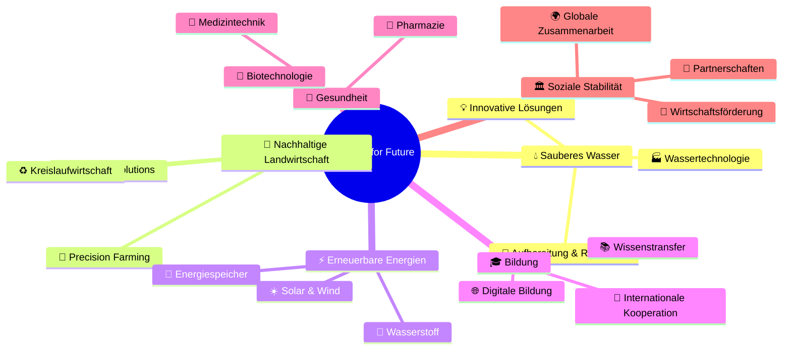
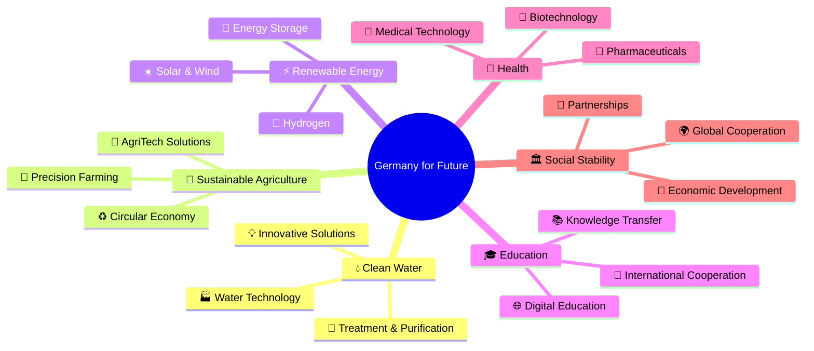

# 🌍 Made in Germany International & Made in Germany Global

<div align="center">

```ascii
███╗   ███╗ █████╗ ██████╗ ███████╗    ██╗███╗   ██╗     ██████╗ ███████╗██████╗ ███╗   ███╗ █████╗ ███╗   ██╗██╗   ██╗
████╗ ████║██╔══██╗██╔══██╗██╔════╝    ██║████╗  ██║    ██╔════╝ ██╔════╝██╔══██╗████╗ ████║██╔══██╗████╗  ██║╚██╗ ██╔╝
██╔████╔██║███████║██║  ██║█████╗      ██║██╔██╗ ██║    ██║  ███╗█████╗  ██████╔╝██╔████╔██║███████║██╔██╗ ██║ ╚████╔╝ 
██║╚██╔╝██║██╔══██║██║  ██║██╔══╝      ██║██║╚██╗██║    ██║   ██║██╔══╝  ██╔══██╗██║╚██╔╝██║██╔══██║██║╚██╗██║  ╚██╔╝  
██║ ╚═╝ ██║██║  ██║██████╔╝███████╗    ██║██║ ╚████║    ╚██████╔╝███████╗██║  ██║██║ ╚═╝ ██║██║  ██║██║ ╚████║   ██║   
╚═╝     ╚═╝╚═╝  ╚═╝╚═════╝ ╚══════╝    ╚═╝╚═╝  ╚═══╝     ╚═════╝ ╚══════╝╚═╝  ╚═╝╚═╝     ╚═╝╚═╝  ╚═╝╚═╝  ╚═══╝   ╚═╝   

 ██████╗ ██╗      ██████╗ ██████╗  █████╗ ██╗           ██╗███╗   ██╗████████╗███████╗██████╗ ███╗   ██╗ █████╗ ████████╗██╗ ██████╗ ███╗   ██╗ █████╗ ██╗     
██╔════╝ ██║     ██╔═══██╗██╔══██╗██╔══██╗██║          ██╔╝████╗  ██║╚══██╔══╝██╔════╝██╔══██╗████╗  ██║██╔══██╗╚══██╔══╝██║██╔═══██╗████╗  ██║██╔══██╗██║     
██║  ███╗██║     ██║   ██║██████╔╝███████║██║         ██╔╝ ██╔██╗ ██║   ██║   █████╗  ██████╔╝██╔██╗ ██║███████║   ██║   ██║██║   ██║██╔██╗ ██║███████║██║     
██║   ██║██║     ██║   ██║██╔══██╗██╔══██║██║        ██╔╝  ██║╚██╗██║   ██║   ██╔══╝  ██╔══██╗██║╚██╗██║██╔══██║   ██║   ██║██║   ██║██║╚██╗██║██╔══██║██║     
╚██████╔╝███████╗╚██████╔╝██████╔╝██║  ██║███████╗  ██╔╝   ██║ ╚████║   ██║   ███████╗██║  ██║██║ ╚████║██║  ██║   ██║   ██║╚██████╔╝██║ ╚████║██║  ██║███████╗
 ╚═════╝ ╚══════╝ ╚═════╝ ╚═════╝ ╚═╝  ╚═╝╚══════╝  ╚═╝    ╚═╝  ╚═══╝   ╚═╝   ╚══════╝╚═╝  ╚═╝╚═╝  ╚═══╝╚═╝  ╚═╝   ╚═╝   ╚═╝ ╚═════╝ ╚═╝  ╚═══╝╚═╝  ╚═╝╚══════╝
```


<table align="center">
<tr>
<td align="center">

</td>
<td align="center">

</td>
<td align="center">

</td>
</tr>
<tr>
<td align="center">

</td>
<td align="center">

</td>
<td align="center">

</td>
</tr>
</table>

### 🎯 **Zwei Namen – eine Vision – eine Zukunft**
*Qualität • Innovation • Verlässlichkeit • Internationale Reichweite*

</div>

---

## 🌟 Willkommen in der Welt von Made in Germany

> **Made in Germany International** und **Made in Germany Global** stehen für **Qualität, Innovation und Verlässlichkeit**. Wir vereinen die **Stärke deutscher Produkte**, den **Pioniergeist deutscher Unternehmen** und die **internationale Reichweite** einer weltweit gefragten Marke.

Ob **Exportmärkte** in **Asien**, **Europa**, **Amerika** oder **Afrika** – **Made in Germany** bedeutet **Vertrauen**, **Präzision** und **Nachhaltigkeit**.

<div align="center">


</div>

## 🙏 Dank und Anerkennung

<div align="center">

### 🌍 **Gratulation an alle Made in Germany Partner weltweit**

</div>

Wir **gratulieren** allen Menschen weltweit, die **Made in Germany-Produkte** schätzen – **Einkäufer**, **Distributoren**, **Händler**, **Produzenten** und **Verbraucher**. Gleichzeitig gilt unsere **Gratulation** und unser **Dank** auch den **Bürgerinnen und Bürgern** in Deutschland, die durch ihre tägliche **Arbeit**, ihr **Engagement** und ihre **Disziplin** dieses internationale **Qualitätsversprechen** möglich machen.

### 🏛️ **Systemrelevante Kräfte als Fundament**

<table>
<tr>
<td width="50%" valign="top">

#### 🏛️ **Institutionen & Politik**
Ein ausdrücklicher **Dank** gilt auch den:
- **Deutschen Politikerinnen und Politikern**
- **Deutschen Behörden**
- **Deutschen Institutionen**
- **Deutschen Gerichten**
- **Deutschen Richtern**
- **Deutschen Justizbeamten**

</td>
<td width="50%" valign="top">

#### 🚨 **Sicherheit & Rettung**
- **Deutschen Polizei**
- **Deutschen Feuerwehr**
- **Deutschen Rettungskräften**
- **Deutschen Krankenhäusern**
- **Deutschen Ärztinnen und Ärzten**
- **Deutschen Pflegekräften und Sanitätern**

</td>
</tr>
</table>

Diese **systemrelevanten Kräfte** sind die **Grundlage** dafür, dass **„Made in Germany"** weltweit für **Sicherheit**, **Stabilität** und **Qualität** steht.

### 🎓 **Bildung & Forschung als Innovationsmotor**

Darüber hinaus anerkennen wir die **Leistungen** von:
- **Lehrkräften**
- **Schulen**  
- **Universitäten**
- **Forschungseinrichtungen** in Deutschland

Die von **frühester Bildung** an **Wissen**, **Werte** und **Disziplin** vermitteln – Eigenschaften, die direkt in die **Exportstärke** und **Innovationskraft** Deutschlands einfließen.

---

## ✨ Germany for Future – die nächste Stufe

<div align="center">

### 🚀 **Ein visionäres Projekt für die Zukunft**

</div>

Neben **Made in Germany Global** und **Made in Germany International** bauen wir mit **Germany for Future** ein **visionäres Projekt** auf.

**Ziel** ist es, die **Innovationskraft** und **Nachhaltigkeit** Deutschlands in die Welt zu tragen – für:

<div align="center">



</div>

Mit **Germany for Future** reichen wir unsere **Hand** in andere **Kulturen**, um gemeinsam **Lösungen** für die **Herausforderungen der Zukunft** zu entwickeln. So verbinden wir das, was **Deutschland heute stark macht**, mit dem, was **die Welt morgen braucht**.

---

## 🚀 Unterstützung für Partner weltweit

<div align="center">

### 💼 **Made in Germany International & Global bedeutet nicht nur Produktqualität**

</div>

Wir begleiten unsere **Partner** auch bei:

<table>
<tr>
<td align="center" width="25%">

<h4>📦 Logistikfragen</h4>
<p>Effiziente Transportlösungen weltweit</p>
</td>
<td align="center" width="25%">

<h4>🛃 Zollabwicklung</h4>
<p>Lieferkettenmanagement & Compliance</p>
</td>
<td align="center" width="25%">

<h4>💰 Exportfinanzierung</h4>
<p>Rechtliche Beratung & Finanzlösungen</p>
</td>
<td align="center" width="25%">

<h4>📱 Digitale Sichtbarkeit</h4>
<p>Globale Markenführung & Online-Präsenz</p>
</td>
</tr>
</table>

So stellen wir sicher, dass **Qualität „Made in Germany"** **effizient**, **sicher** und **erfolgreich** in alle **Märkte der Welt** gelangt.

---

## 🔑 SEO Keyword-Cluster

<div align="center">

### 📊 **Unsere Kernkompetenzen im Überblick**

</div>

<details>
<summary>🌍 <strong>Made in Germany Keywords</strong></summary>

- **Made in Germany International**
- **Made in Germany Global**
- **Germany for Future**
- **deutsche Exportwirtschaft**
- **deutsche Innovation**
- **deutsche Qualität**
- **deutsche Produkte exportieren**
- **internationale Märkte erschließen**
- **nachhaltiger Export**
- **deutsche Unternehmen international**

</details>

<details>
<summary>🚀 <strong>Export & Technologie</strong></summary>

- **Export Deutschland**
- **deutsche Technologie weltweit**
- **deutsche Industrie 4.0**
- **deutsche Lieferketten**
- **Exportmärkte Asien Europa Amerika Afrika**
- **deutsche Logistiklösungen**
- **deutsche Zollabwicklung**

</details>

<details>
<summary>🏛️ <strong>Institutionen & Gesellschaft</strong></summary>

- **deutsche Politik und Export**
- **deutsche Institutionen international**
- **deutsche Gesellschaft und Wirtschaft**
- **deutsche Forschung global**
- **deutsche Bildung international**
- **deutsche Nachhaltigkeit exportieren**

</details>

---

## 🌐 Offizielle Domains & Plattformen

<div align="center">

### 🔗 **Unsere digitale Präsenz**

<table>
<tr>
<td align="center">
<a href="https://made-in-germany-global.com">

</a>
</td>
<td align="center">
<a href="https://made-in-germany-international.com">

</a>
</td>
</tr>
<tr>
<td align="center">
<a href="https://germany-for-future.com">

</a>
</td>
<td align="center">
<a href="https://made-in-germany.global">

</a>
</td>
</tr>
</table>

### 📞 **Kontakt & Community**

<table>
<tr>
<td align="center">
<a href="mailto:contact@made-in-germany-global.com">

</a>
</td>
<td align="center">
<a href="mailto:info@made-in-germany-international.com">

</a>
</td>
</tr>
<tr>
<td align="center">
<a href="mailto:future@germany-for-future.com">

</a>
</td>
<td align="center">
<a href="https://discord.gg/made-in-germany">

</a>
</td>
</tr>
</table>

</div>

---

## 🎯 Meta-Daten

<div align="center">

### 📝 **SEO-Optimierung**

</div>

**SEO-Titel:**
> Made in Germany International & Global | Qualität, Innovation & Germany for Future

**Meta-Description:**  
> Made in Germany International & Made in Germany Global – zwei Namen, eine Mission: deutsche Qualität weltweit exportieren. Mit Germany for Future verbinden wir Innovation, Nachhaltigkeit und Zukunftsvision.

---

## 🤝 Einladung zur Mitgestaltung

<div align="center">

### 🌟 **Werden Sie Teil der Bewegung**

</div>

Wir **laden** alle **Menschen**, **Unternehmen**, **Institutionen** und **Partner** weltweit ein, **Teil dieser Bewegung** zu werden. Gemeinsam können wir die **deutsche Exportwirtschaft** stärken, **Innovation global sichtbar** machen und mit **Germany for Future** neue **Maßstäbe** setzen.

<table>
<tr>
<td align="center" width="25%">
<h4>🏢 Unternehmen</h4>
<p>Exportchancen maximieren</p>
</td>
<td align="center" width="25%">
<h4>💰 Investoren</h4>
<p>Nachhaltige Renditen</p>
</td>
<td align="center" width="25%">
<h4>🎓 Studenten</h4>
<p>Internationale Karrieren</p>
</td>
<td align="center" width="25%">
<h4>🤝 Partner</h4>
<p>Globale Kooperationen</p>
</td>
</tr>
</table>

### 🚀 **Nächste Schritte**

<div align="center">

<table>
<tr>
<td align="center">
<a href="https://made-in-germany-global.com/join">

</a>
</td>
<td align="center">
<a href="https://discord.gg/made-in-germany">

</a>
</td>
<td align="center">
<a href="mailto:contact@made-in-germany-global.com">

</a>
</td>
</tr>
</table>

</div>

---

## 📊 Repository Statistiken

<div align="center">

### 📈 **Projekt-Metriken**

<table>
<tr>
<td width="50%" align="center">


</td>
<td width="50%" align="center">


</td>
</tr>
</table>


</div>

---

## 🌍 Premium-SEO-Footer für GitHub-Profil & Repositories

**Made in Germany Global** | **Made in Germany International** | **Germany for Future** – **drei starke Namen**, **eine klare Mission**: die Werte von **Qualität**, **Innovation**, **Nachhaltigkeit** und **Verlässlichkeit** aus Deutschland sichtbar machen und weltweit verankern. 

Dieses Projekt verbindet die **Stärken deutscher Unternehmen**, **deutscher Entwicklerinnen und Entwickler**, **deutscher Exportmärkte** und **deutscher Institutionen** mit **internationalen Partnern**, **globalen Netzwerken** und einer **zukunftsorientierten Vision**.

Ob im Bereich **Export**, **International Trade**, **Qualitätssicherung**, **Zertifizierungen**, **Logistik**, **Lieferketten**, **Zollabwicklung** oder **nachhaltige Innovationen** – hier entsteht ein **Ökosystem**, das **Made in Germany global** und **international** als **Synonym für Spitzenleistung** etabliert.

Wir **gratulieren** und **danken** allen, die **Made in Germany-Produkte** weltweit schätzen – **Einkäufern**, **Distributoren**, **Unternehmen**, **Institutionen** und den **Bürgerinnen und Bürgern** in Deutschland. Besonderer **Dank** gilt den **deutschen Behörden**, **deutschen Institutionen**, **deutschen Gerichten**, der **deutschen Justiz**, der **deutschen Polizei**, **Feuerwehr**, **Rettungskräften**, **Ärztinnen**, **Ärzten**, **Pflegekräften** und allen **systemrelevanten Bereichen**, die das **Fundament für Vertrauen** und **Stabilität** schaffen.

Mit **Germany for Future** reichen wir die **Hand in die Welt**: für **sauberes Wasser**, **moderne Landwirtschaft**, **nachhaltige Technologien**, **Bildung**, **Innovation** und **globale Zusammenarbeit**. Wir laden **Unternehmen**, **Investorinnen**, **Sponsoren**, **Entwickler**, **Studierende** und **Partner** ein, **Teil dieser Bewegung** zu werden – für ein **starkes**, **modernes** und **weltoffenes Deutschland**, das durch **Export**, **Qualität** und **Zukunftsvisionen** überzeugt.

---

<div align="center">


### 🌟 **Made in Germany Global. Made in Germany International. Germany for Future.** 🌟

**🔧 Drei Perspektiven, ein Ziel: Deutschland in die Welt tragen – und die Welt ein Stück besser machen 🌎**

*Ein Versprechen – für heute und für morgen*

---

**🎯 Bereit für die Zukunft?**  
[Made in Germany Global](https://made-in-germany-global.com) • [Made in Germany International](https://made-in-germany-international.com) • [Germany for Future](https://germany-for-future.com)

**🌟 Made with German Excellence and Global Vision 🌟**

</div>


# 🌍 Made in Germany International & Made in Germany Global

<div align="center">

```ascii
███╗   ███╗ █████╗ ██████╗ ███████╗    ██╗███╗   ██╗     ██████╗ ███████╗██████╗ ███╗   ███╗ █████╗ ███╗   ██╗██╗   ██╗
████╗ ████║██╔══██╗██╔══██╗██╔════╝    ██║████╗  ██║    ██╔════╝ ██╔════╝██╔══██╗████╗ ████║██╔══██╗████╗  ██║╚██╗ ██╔╝
██╔████╔██║███████║██║  ██║█████╗      ██║██╔██╗ ██║    ██║  ███╗█████╗  ██████╔╝██╔████╔██║███████║██╔██╗ ██║ ╚████╔╝ 
██║╚██╔╝██║██╔══██║██║  ██║██╔══╝      ██║██║╚██╗██║    ██║   ██║██╔══╝  ██╔══██╗██║╚██╔╝██║██╔══██║██║╚██╗██║  ╚██╔╝  
██║ ╚═╝ ██║██║  ██║██████╔╝███████╗    ██║██║ ╚████║    ╚██████╔╝███████╗██║  ██║██║ ╚═╝ ██║██║  ██║██║ ╚████║   ██║   
╚═╝     ╚═╝╚═╝  ╚═╝╚═════╝ ╚══════╝    ╚═╝╚═╝  ╚═══╝     ╚═════╝ ╚══════╝╚═╝  ╚═╝╚═╝     ╚═╝╚═╝  ╚═╝╚═╝  ╚═══╝   ╚═╝   

 ██████╗ ██╗      ██████╗ ██████╗  █████╗ ██╗           ██╗███╗   ██╗████████╗███████╗██████╗ ███╗   ██╗ █████╗ ████████╗██╗ ██████╗ ███╗   ██╗ █████╗ ██╗     
██╔════╝ ██║     ██╔═══██╗██╔══██╗██╔══██╗██║          ██╔╝████╗  ██║╚══██╔══╝██╔════╝██╔══██╗████╗  ██║██╔══██╗╚══██╔══╝██║██╔═══██╗████╗  ██║██╔══██╗██║     
██║  ███╗██║     ██║   ██║██████╔╝███████║██║         ██╔╝ ██╔██╗ ██║   ██║   █████╗  ██████╔╝██╔██╗ ██║███████║   ██║   ██║██║   ██║██╔██╗ ██║███████║██║     
██║   ██║██║     ██║   ██║██╔══██╗██╔══██║██║        ██╔╝  ██║╚██╗██║   ██║   ██╔══╝  ██╔══██╗██║╚██╗██║██╔══██║   ██║   ██║██║   ██║██║╚██╗██║██╔══██║██║     
╚██████╔╝███████╗╚██████╔╝██████╔╝██║  ██║███████╗  ██╔╝   ██║ ╚████║   ██║   ███████╗██║  ██║██║ ╚████║██║  ██║   ██║   ██║╚██████╔╝██║ ╚████║██║  ██║███████╗
 ╚═════╝ ╚══════╝ ╚═════╝ ╚═════╝ ╚═╝  ╚═╝╚══════╝  ╚═╝    ╚═╝  ╚═══╝   ╚═╝   ╚══════╝╚═╝  ╚═╝╚═╝  ╚═══╝╚═╝  ╚═╝   ╚═╝   ╚═╝ ╚═════╝ ╚═╝  ╚═══╝╚═╝  ╚═╝╚══════╝
```


<table align="center">
<tr>
<td align="center">

</td>
<td align="center">

</td>
<td align="center">

</td>
</tr>
<tr>
<td align="center">

</td>
<td align="center">

</td>
<td align="center">

</td>
</tr>
</table>

### 🎯 **Two Names – One Vision – One Future**
*Quality • Innovation • Reliability • International Reach*

</div>

---

## 🌟 Welcome to the World of Made in Germany

> **Made in Germany International** and **Made in Germany Global** stand for **quality, innovation and reliability**. We unite the **strength of German products**, the **pioneer spirit of German companies** and the **international reach** of a globally sought-after brand.

Whether **export markets** in **Asia**, **Europe**, **America** or **Africa** – **Made in Germany** means **trust**, **precision** and **sustainability**.

<div align="center">


</div>

## 🙏 Thanks and Recognition

<div align="center">

### 🌍 **Congratulations to all Made in Germany Partners Worldwide**

</div>

We **congratulate** all people worldwide who appreciate **Made in Germany products** – **buyers**, **distributors**, **dealers**, **producers** and **consumers**. At the same time, our **congratulations** and our **thanks** also go to the **citizens** of Germany, who through their daily **work**, their **commitment** and their **discipline** make this international **quality promise** possible.

### 🏛️ **System-Relevant Forces as Foundation**

<table>
<tr>
<td width="50%" valign="top">

#### 🏛️ **Institutions & Politics**
Special **thanks** also goes to:
- **German Politicians (male and female)**
- **German Authorities**
- **German Institutions**
- **German Courts**
- **German Judges**
- **German Justice Officials**

</td>
<td width="50%" valign="top">

#### 🚨 **Security & Rescue**
- **German Police**
- **German Fire Department**
- **German Rescue Services**
- **German Hospitals**
- **German Doctors (male and female)**
- **German Nurses and Paramedics**

</td>
</tr>
</table>

These **system-relevant forces** are the **foundation** for **"Made in Germany"** standing worldwide for **security**, **stability** and **quality**.

### 🎓 **Education & Research as Innovation Engine**

Furthermore, we acknowledge the **achievements** of:
- **Teachers**
- **Schools**  
- **Universities**
- **Research Institutions** in Germany

Who convey **knowledge**, **values** and **discipline** from the **earliest education** – qualities that directly flow into Germany's **export strength** and **innovative power**.

---

## ✨ Germany for Future – The Next Level

<div align="center">

### 🚀 **A Visionary Project for the Future**

</div>

In addition to **Made in Germany Global** and **Made in Germany International**, we are building **Germany for Future** as a **visionary project**.

The **goal** is to carry Germany's **innovative power** and **sustainability** into the world – for:

<div align="center">



</div>

With **Germany for Future**, we extend our **hand** to other **cultures** to jointly develop **solutions** for the **challenges of the future**. This way, we connect what **makes Germany strong today** with what **the world needs tomorrow**.

---

## 🚀 Support for Partners Worldwide

<div align="center">

### 💼 **Made in Germany International & Global means more than just product quality**

</div>

We also support our **partners** with:

<table>
<tr>
<td align="center" width="25%">

<h4>📦 Logistics Issues</h4>
<p>Efficient transport solutions worldwide</p>
</td>
<td align="center" width="25%">

<h4>🛃 Customs Clearance</h4>
<p>Supply chain management & compliance</p>
</td>
<td align="center" width="25%">

<h4>💰 Export Financing</h4>
<p>Legal consulting & financial solutions</p>
</td>
<td align="center" width="25%">

<h4>📱 Digital Visibility</h4>
<p>Global brand management & online presence</p>
</td>
</tr>
</table>

This ensures that **quality "Made in Germany"** reaches all **markets of the world** **efficiently**, **safely** and **successfully**.

---

## 🔑 SEO Keyword Cluster

<div align="center">

### 📊 **Our Core Competencies at a Glance**

</div>

<details>
<summary>🌍 <strong>Made in Germany Keywords</strong></summary>

- **Made in Germany International**
- **Made in Germany Global**
- **Germany for Future**
- **German export economy**
- **German innovation**
- **German quality**
- **export German products**
- **open international markets**
- **sustainable export**
- **German companies international**

</details>

<details>
<summary>🚀 <strong>Export & Technology</strong></summary>

- **Export Germany**
- **German technology worldwide**
- **German Industry 4.0**
- **German supply chains**
- **Export markets Asia Europe America Africa**
- **German logistics solutions**
- **German customs clearance**

</details>

<details>
<summary>🏛️ <strong>Institutions & Society</strong></summary>

- **German politics and export**
- **German institutions international**
- **German society and economy**
- **German research global**
- **German education international**
- **export German sustainability**

</details>

---

## 🌐 Official Domains & Platforms

<div align="center">

### 🔗 **Our Digital Presence**

<table>
<tr>
<td align="center">
<a href="https://made-in-germany-global.com">

</a>
</td>
<td align="center">
<a href="https://made-in-germany-international.com">

</a>
</td>
</tr>
<tr>
<td align="center">
<a href="https://germany-for-future.com">

</a>
</td>
<td align="center">
<a href="https://made-in-germany.global">

</a>
</td>
</tr>
</table>

### 📞 **Contact & Community**

<table>
<tr>
<td align="center">
<a href="mailto:contact@made-in-germany-global.com">

</a>
</td>
<td align="center">
<a href="mailto:info@made-in-germany-international.com">

</a>
</td>
</tr>
<tr>
<td align="center">
<a href="mailto:future@germany-for-future.com">

</a>
</td>
<td align="center">
<a href="https://discord.gg/made-in-germany">

</a>
</td>
</tr>
</table>

</div>

---

## 🎯 Meta Data

<div align="center">

### 📝 **SEO Optimization**

</div>

**SEO Title:**
> Made in Germany International & Global | Quality, Innovation & Germany for Future

**Meta Description:**  
> Made in Germany International & Made in Germany Global – two names, one mission: export German quality worldwide. With Germany for Future, we combine innovation, sustainability and future vision.

---

## 🤝 Invitation to Participate

<div align="center">

### 🌟 **Become Part of the Movement**

</div>

We **invite** all **people**, **companies**, **institutions** and **partners** worldwide to **become part of this movement**. Together we can strengthen the **German export economy**, make **innovation globally visible** and set new **standards** with **Germany for Future**.

<table>
<tr>
<td align="center" width="25%">
<h4>🏢 Companies</h4>
<p>Maximize export opportunities</p>
</td>
<td align="center" width="25%">
<h4>💰 Investors</h4>
<p>Sustainable returns</p>
</td>
<td align="center" width="25%">
<h4>🎓 Students</h4>
<p>International careers</p>
</td>
<td align="center" width="25%">
<h4>🤝 Partners</h4>
<p>Global cooperations</p>
</td>
</tr>
</table>

### 🚀 **Next Steps**

<div align="center">

<table>
<tr>
<td align="center">
<a href="https://made-in-germany-global.com/join">

</a>
</td>
<td align="center">
<a href="https://discord.gg/made-in-germany">

</a>
</td>
<td align="center">
<a href="mailto:contact@made-in-germany-global.com">

</a>
</td>
</tr>
</table>

</div>

---

## 📊 Repository Statistics

<div align="center">

### 📈 **Project Metrics**

<table>
<tr>
<td width="50%" align="center">


</td>
<td width="50%" align="center">


</td>
</tr>
</table>


</div>

---

## 🌍 Premium SEO Footer for GitHub Profile & Repositories

**Made in Germany Global** | **Made in Germany International** | **Germany for Future** – **three strong names**, **one clear mission**: to make the values of **quality**, **innovation**, **sustainability** and **reliability** from Germany visible and anchor them worldwide.

This project connects the **strengths of German companies**, **German developers (male and female)**, **German export markets** and **German institutions** with **international partners**, **global networks** and a **future-oriented vision**.

Whether in the field of **export**, **international trade**, **quality assurance**, **certifications**, **logistics**, **supply chains**, **customs clearance** or **sustainable innovations** – here an **ecosystem** is being created that establishes **Made in Germany globally** and **internationally** as a **synonym for excellence**.

We **congratulate** and **thank** all those who appreciate **Made in Germany products** worldwide – **buyers**, **distributors**, **companies**, **institutions** and the **citizens** of Germany. Special **thanks** go to **German authorities**, **German institutions**, **German courts**, **German justice system**, **German police**, **fire department**, **rescue services**, **doctors (male and female)**, **nurses** and all **system-relevant areas** that create the **foundation for trust** and **stability**.

With **Germany for Future**, we extend our **hand to the world**: for **clean water**, **modern agriculture**, **sustainable technologies**, **education**, **innovation** and **global cooperation**. We invite **companies**, **investors (male and female)**, **sponsors**, **developers**, **students** and **partners** to **become part of this movement** – for a **strong**, **modern** and **cosmopolitan Germany** that convinces through **export**, **quality** and **future visions**.

---

<div align="center">


### 🌟 **Made in Germany Global. Made in Germany International. Germany for Future.** 🌟

**🔧 Three perspectives, one goal: Bring Germany to the world – and make the world a little better 🌎**

*A promise – for today and tomorrow*

---

**🎯 Ready for the Future?**  
[Made in Germany Global](https://made-in-germany-global.com) • [Made in Germany International](https://made-in-germany-international.com) • [Germany for Future](https://germany-for-future.com)

**🌟 Made with German Excellence and Global Vision 🌟**

</div>
